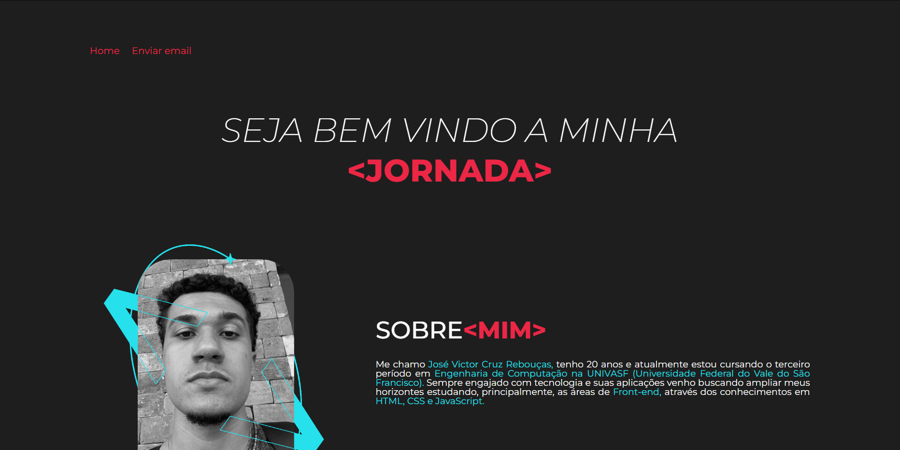
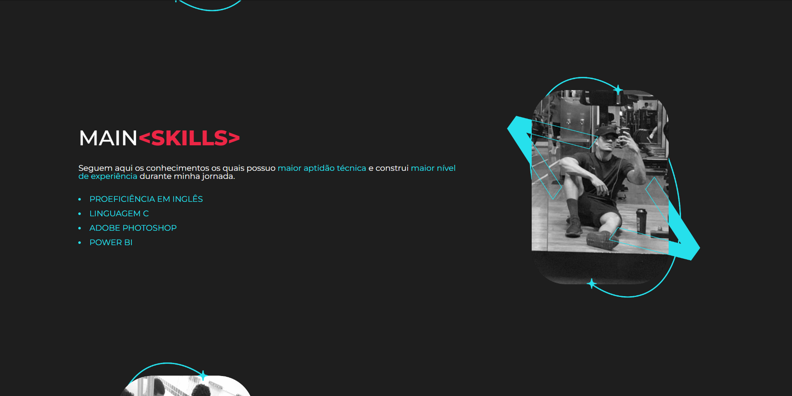
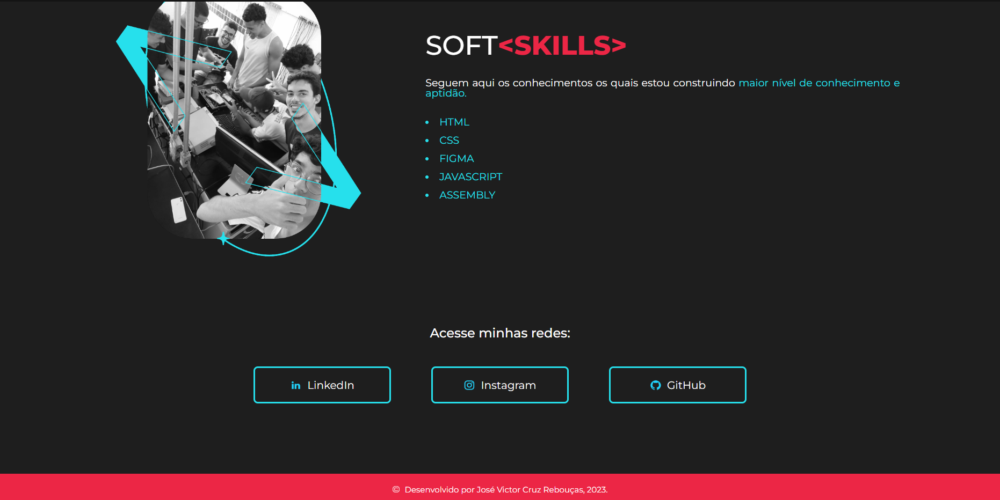

# About Me Website

This is a simple "About Me" website built using HTML and CSS. The website is designed to be clean and easy to read, with a focus on showcasing the person's skills, experiences, and personality.

## Features

- Responsive design: The website is designed to look great on all devices, from small smartphones to large desktop computers.
- Customizable: The website can be easily customized to fit the person's personal style and preferences.
- Easy to use: The website is built using simple HTML and CSS, making it easy for anyone to understand and modify.
  

## Getting Started

To get started with the website, you can either download the source code from this repository or clone the repository to your local machine.

Once you have the source code, you can open the `index.html` file in a web browser to view the website.

To customize the website, you can edit the HTML and CSS files in a text editor or an integrated development environment (IDE).

## Contributing

If you would like to contribute to the project, please feel free to submit a pull request on the GitHub repository.
